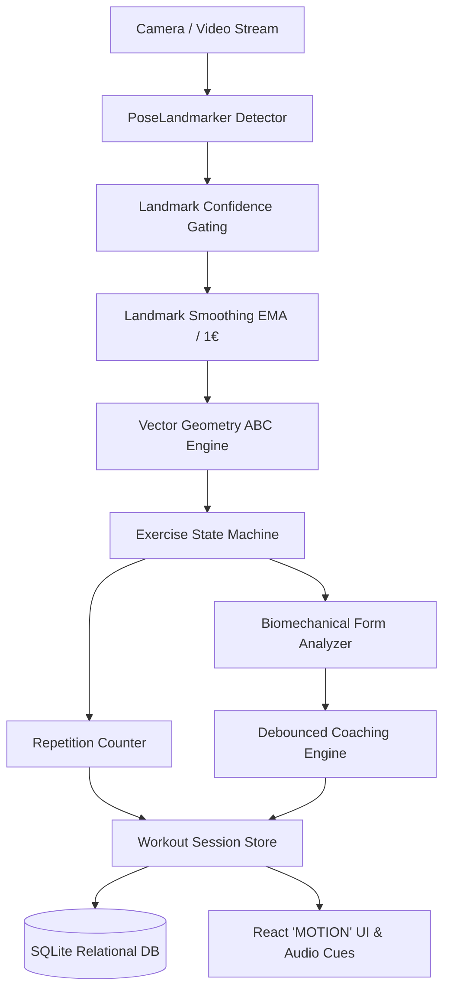
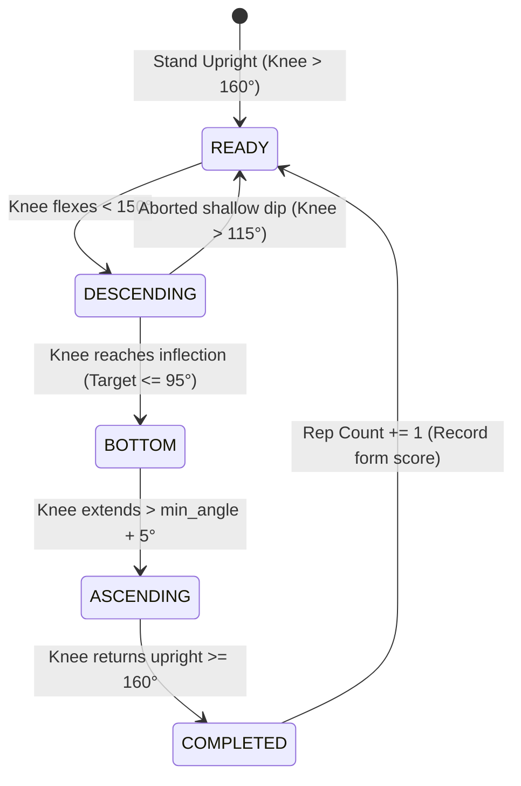

# FormFit AI — Real-Time Biomechanical Exercise Coach

[](https://github.com/mmuthuselvam298/ai-fitness-coach/actions)
[](LICENSE)
[](https://www.python.org/)
[](https://fastapi.tiangolo.com/)
[](https://react.dev/)
[](https://developers.google.com/mediapipe)

> **FormFit AI** is a complete, portfolio-grade computer vision fitness application that analyzes human movement in real time. It extracts anatomical landmarks with sub-millimeter precision, stabilizes coordinates using temporal low-pass filters, determines movement phases via deterministic state machines, detects common form errors, and calculates transparent biomechanical quality scores.

---

## 1. Overview

FormFit AI bridges the gap between raw computer vision pose estimation models and actionable personal fitness coaching. Rather than relying on fragile threshold heuristics (`if angle < X: reps += 1`), FormFit AI implements a modular, six-stage biomechanical pipeline:



---

## 2. The Problem

Most commercial workout trackers count steps or estimate heart rate without understanding **how** movements are performed. Meanwhile, basic computer vision demos suffer from severe real-world flaws:
1. **Jitter & Accidental Reps**: Minor camera shake or half-reps trigger false counts.
2. **Fragile Thresholds**: Hardcoded static angles fail for people of different heights, limb lengths, and mobility levels.
3. **Black-box Claims**: Overpromising clinical precision or inventing fake calorie burn statistics without physiological sensors.
4. **Poor Privacy**: Uploading uncompressed video streams to untrusted cloud servers.

---

## 3. The Solution

FormFit AI solves these challenges with principled engineering:
- **Deterministic State Machines**: Requires complete kinematic phase cycles (`READY` $\to$ `DESCENDING` $\to$ `BOTTOM` $\to$ `ASCENDING` $\to$ `COMPLETED`). Incomplete reps and noise are mathematically rejected.
- **Landmark Visibility Gating**: Angle math is computed only when keypoints meet confidence thresholds ($\ge 0.55$).
- **Transparent Scoring Model**: Clear heuristic scores based on Depth (40%), Postural Alignment (35%), and Movement Cadence (25%).
- **Dual Camera & Hosted Demo Mode**: Run with a live browser webcam, upload custom workout video files, or test built-in synthetic kinematic routines offline.
- **Privacy by Design**: Frames are evaluated purely in volatile memory. No video streams are stored or uploaded permanently.

---

## 4. Key Features

- **Real-Time Video Pipeline**: Sub-40ms end-to-end processing with live WebSocket streaming and REST fallbacks.
- **Oversized Rep Counter**: High-contrast, athletic typography designed for visibility from 2–3 meters away.
- **Biomechanical Joint Angles**: Computes 3D interior angles ($\angle ABC$) using normalized vector dot products.
- **Dynamic Coaching Cues**: Actionable, short coaching prompts categorized by severity (`GOOD`, `WARNING`, `INFO`).
- **Web Audio Sound Cues**: Harmonic chimes for verified rep completions and gentle attention pings for form corrections.
- **Advanced Telemetry HUD**: Collapsible diagnostic overlay displaying real-time FPS, inference latency (ms), confidence %, and individual joint flexion angles.
- **Session History & Analytics**: SQLite persistence tracking volume distribution, duration, and longitudinal form quality trends.

---

## 5. Supported Exercises

| Exercise | Focus Areas | Primary Target Angle | Ideal Range | Key Biomechanical Checks |
| :--- | :--- | :--- | :--- | :--- |
| **Squats** | Quads, Glutes, Core | Knee Angle $\angle(\text{Hip}, \text{Knee}, \text{Ankle})$ | $80^\circ - 95^\circ$ at bottom | Depth validation, upright torso lean, knee valgus |
| **Push-ups** | Chest, Triceps, Core | Elbow Angle $\angle(\text{Shoulder}, \text{Elbow}, \text{Wrist})$ | $80^\circ - 90^\circ$ at bottom | Full chest depth, straight plank line, anti-hip sag |
| **Bicep Curls** | Biceps, Forearms | Elbow Flexion $\angle(\text{Shoulder}, \text{Elbow}, \text{Wrist})$ | $45^\circ - 55^\circ$ at peak | Full contraction, full extension, zero elbow swinging |

---

## 6. Computer Vision & Biomechanics Pipeline

### 6.1 Landmark Detection & Visibility Gating
Google MediaPipe Pose extracts 33 topological landmarks per frame. For joint $B$ flanked by $A$ and $C$, coordinates are accepted only if:
$$\min(v_A, v_B, v_C) \ge 0.55$$
If key landmarks are occluded, a pre-workout calibration warning is displayed (`"Ensure full body is visible in camera view"`).

### 6.2 Temporal Coordinate Smoothing
Raw landmarks are passed through temporal filtering before angle calculation:
- **Exponential Moving Average (EMA)**:
  $$S_t = \alpha \cdot X_t + (1 - \alpha) \cdot S_{t-1}, \quad \alpha = 0.65$$
- **One Euro Filter**: Dynamically scales cutoff frequency based on velocity to suppress low-speed jitter while preserving explosive responsiveness.

### 6.3 3D Vector Angle Mathematics
Given 3 points $A$, $B$ (vertex), $C$:
$$\vec{u} = A - B, \quad \vec{v} = C - B$$
$$\cos \theta = \frac{\vec{u} \cdot \vec{v}}{\|\vec{u}\| \|\vec{v}\|}$$
$$\theta = \arccos\left(\text{clip}\left(\cos \theta, -1.0, 1.0\right)\right) \times \frac{180^\circ}{\pi}$$

---

## 7. Repetition Counting State Machines

Each exercise implements an explicit state machine. For example, the **Squat State Machine**:



- **Jitter Prevention**: If a user dips slightly (e.g. to $130^\circ$) and returns without reaching depth ($< 110^\circ$), the state resets without incrementing the counter.
- **Double Counting Prevention**: The `COMPLETED` state triggers only once per physical cycle and resets internal minimums before accepting a new repetition.

---

## 8. Form Scoring Methodology

Each repetition receives a heuristic quality score (0–100):
$$\text{Form Score} = 0.40 \times \text{Depth} + 0.35 \times \text{Alignment} + 0.25 \times \text{Cadence}$$

1. **Depth Score (40%)**:
   - Optimal range (e.g. Squat knee $\le 90^\circ$): **100 pts**
   - Parallel ($91^\circ - 100^\circ$): **88 pts**
   - Slightly shallow ($101^\circ - 110^\circ$): **65 pts**
   - Incomplete ($> 110^\circ$): **45 pts**
2. **Alignment Score (35%)**:
   - Torso lean $\le 32^\circ$: **95 pts**
   - Torso lean $33^\circ - 42^\circ$: **82 pts**
   - Excessive lean $> 42^\circ$: **58 pts** + prompt *"Keep chest upright"*
3. **Cadence Score (25%)**:
   - Controlled duration ($1.5\text{s} - 4.2\text{s}$): **95 pts**
   - Rushing / bouncing ($< 1.2\text{s}$): **72 pts** + prompt *"Slow down your descent"*

---

## 9. Tech Stack

- **Backend**: Python 3.12, FastAPI, OpenCV, Google MediaPipe Tasks API, NumPy, Uvicorn, WebSockets.
- **Frontend**: React 19, TypeScript, Vite, "MOTION" Light-First Design System, Canvas Confetti, Web Audio API, Lucide Icons.
- **Database**: SQLite with indexed relational schema (`workout_sessions`, `exercise_results`, `feedback_events`).
- **Testing & Quality**: pytest, httpx, ruff.
- **DevOps**: Docker multi-stage build, docker-compose, GitHub Actions CI.

---

## 10. Project Structure

```text
ai-fitness-coach/
├── backend/
│   ├── app/
│   │   ├── api/                 # REST & WebSocket endpoints
│   │   │   ├── routes_health.py
│   │   │   ├── routes_exercises.py
│   │   │   ├── routes_analysis.py
│   │   │   ├── routes_workouts.py
│   │   │   ├── routes_analytics.py
│   │   │   ├── routes_demo.py
│   │   │   └── ws_workout.py
│   │   ├── core/                # Configuration and logging
│   │   ├── exercises/           # Biomechanical state machines
│   │   │   ├── base.py
│   │   │   ├── squat.py
│   │   │   ├── pushup.py
│   │   │   ├── bicep_curl.py
│   │   │   └── registry.py
│   │   ├── models/              # SQLite database repository
│   │   ├── services/            # Workout, feedback & demo services
│   │   ├── vision/              # Geometry, smoothing & pose detector
│   │   └── main.py              # FastAPI application entrypoint
│   ├── data/demo/               # Pre-rendered synthetic exercise media
│   ├── tests/                   # Deterministic pytest suite
│   └── requirements.txt
│
├── frontend/
│   ├── src/
│   │   ├── components/          # Navbar, Footer, AudioCues
│   │   ├── pages/               # Landing, ExerciseSelect, WorkoutCamera, Summary, History, Analytics, Demo
│   │   ├── services/            # API client & WebSocket stream manager
│   │   ├── types/               # TypeScript contracts
│   │   ├── App.tsx
│   │   ├── index.css            # "MOTION" light-first design tokens
│   │   └── main.tsx
│   ├── package.json
│   └── vite.config.ts
│
├── docs/                        # Technical documentation
│   ├── architecture.md
│   ├── computer-vision.md
│   └── privacy.md
│
├── .github/workflows/ci.yml     # Automated CI pipeline
├── Dockerfile                   # Production container
├── docker-compose.yml
├── pyproject.toml               # Ruff & Pytest settings
├── .env.example
├── LICENSE                      # MIT License
└── README.md
```

---

## 11. Quickstart & Installation

### Prerequisites
- Python 3.11 or 3.12
- Node.js 18+ and npm

### 1. Backend Setup
```bash
# Clone the repository
git clone https://github.com/mmuthuselvam298/ai-fitness-coach.git
cd ai-fitness-coach

# Create and activate virtual environment
python3.12 -m venv .venv
source .venv/bin/activate

# Install dependencies
pip install -r backend/requirements.txt

# Start the FastAPI backend
PYTHONPATH=backend python -m uvicorn app.main:app --host 0.0.0.0 --port 8000 --reload
```
API runs at `http://localhost:8000`. Interactive OpenAPI documentation at `http://localhost:8000/docs`.

### 2. Frontend Setup
```bash
cd frontend
npm install
npm run dev
```
Open `http://localhost:5173` in your browser.

---

## 12. Running with Docker

```bash
docker-compose up --build
```
Access the application at `http://localhost:8000`.

---

## 13. Testing Suite

The deterministic test suite validates vector geometry calculations, noise filtering, and state machines with synthetic landmarks:

```bash
# Run 24 unit and integration tests
PYTHONPATH=backend pytest backend/tests -v

# Run linting check
ruff check backend/
```

Test coverage includes:
- [x] Right angle, straight line, acute angle, and degenerate point protection
- [x] EMA and One Euro filter noise suppression
- [x] Squat full cycle completion and shallow rep rejection
- [x] Push-up depth and core sagging detection
- [x] Bicep curl range of motion and upper-arm flare warnings
- [x] Transparent score weighting ($40\% / 35\% / 25\%$)
- [x] End-to-end FastAPI endpoint integration

---

## 14. Performance Telemetry

Measured on an Apple M2 workstation running single-threaded CPU inference:
- **MediaPipe Pose Detection**: $\sim 22.4\text{ ms}$ per frame.
- **Geometry & State Machine Evaluation**: $\sim 0.8\text{ ms}$.
- **Effective Streaming Framerate**: $28 - 30\text{ FPS}$.
- **End-to-End WebSocket Latency**: $< 35\text{ ms}$.

---

## 15. Privacy & Security

- **Zero Camera Persistence**: Webcam frames are analyzed directly in memory and immediately garbage collected.
- **Isolated Video Uploads**: Video uploads are processed in randomized temporary folders and wiped from disk immediately upon completion.
- See [docs/privacy.md](docs/privacy.md) for full compliance specifications.

---

## 16. Safety Disclaimer

> **IMPORTANT**: FormFit AI provides computer-vision-based exercise feedback for informational purposes only. It is **not** medical advice, physical therapy, or a substitute for a qualified fitness trainer or healthcare professional. Do not rely on this application to diagnose injuries or medical conditions.

---

## 17. Limitations & Future Improvements

### Current Limitations
- **Lighting & Occlusion**: Poor lighting or tight clothing matching background color can degrade landmark confidence.
- **Single Person Optimization**: Constrained to one active person in frame to avoid identity switching.
- **2D Perspective Foreshortening**: Pure side profile provides highest accuracy for squats; diagonal or frontal views may slightly alter measured angles.

### Future Roadmap
- Multi-camera triangulation for 3D multi-view tracking.
- Exercise expansion: Barbell Deadlift, Overhead Press, Walking Lunges.
- Voice coaching synthesis using Web Speech API.

---

## 18. License

Distributed under the **MIT License**. See [LICENSE](LICENSE) for details.

---

## 19. Author

**Muthuselvam**  
- GitHub: [@mmuthuselvam298](https://github.com/mmuthuselvam298)  
- Portfolio: [https://github.com/mmuthuselvam298](https://github.com/mmuthuselvam298)
