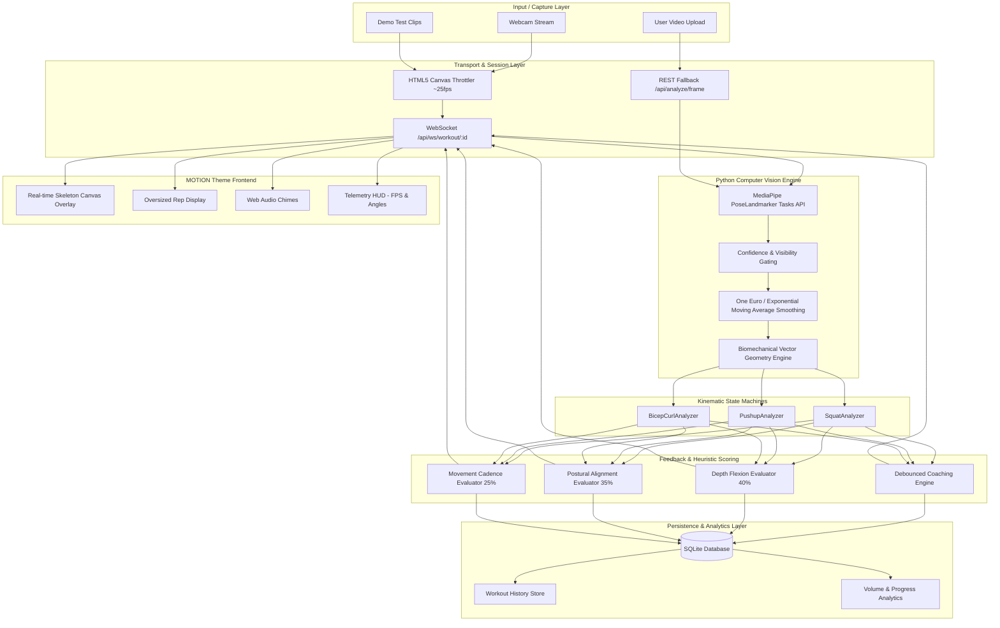

# FormFit AI — System Architecture

## 1. High-Level Architectural Overview

FormFit AI employs an asynchronous, event-driven computer vision pipeline designed for sub-40ms end-to-end latency across video processing, landmark stabilization, kinematic state transitions, and UI overlay rendering.

## 2. Component Breakdown

### A. Computer Vision Engine (`backend/app/vision/`)
- **PoseLandmarker**: Modern Google MediaPipe Tasks API running with Metal / XNNPACK hardware acceleration.
- **Landmark Filtering**: Low-pass Exponential Moving Average (EMA) and 1D One Euro filters minimize high-frequency camera jitter while preserving zero-latency response during rapid explosive lifts.
- **Geometry Module**: Vector dot product and $\arccos$ calculation with numerical clipping prevents NaN errors in degenerate configurations.

### B. Kinematic State Machines (`backend/app/exercises/`)
Exercises derive from `ExerciseAnalyzer` and model physical exercise as deterministic finite state automata:
- **Squat**: `READY` $\to$ `DESCENDING` $\to$ `BOTTOM` $\to$ `ASCENDING` $\to$ `COMPLETED` $\to$ `READY`.
- **Push-up**: `TOP` $\to$ `DESCENDING` $\to$ `BOTTOM` $\to$ `ASCENDING` $\to$ `COMPLETED` $\to$ `TOP`.
- **Bicep Curl**: `EXTENDED` $\to$ `CURLING` $\to$ `CONTRACTED` $\to$ `RETURNING` $\to$ `COMPLETED` $\to$ `EXTENDED`.

Repetition counts increment **only** after crossing the bottom inflection threshold and returning to the completed upright state. Incomplete or aborted dips are automatically discarded without false increments.

### C. Heuristic Form Scoring Engine
Repetitions receive a deterministic form quality score between 0 and 100:
$$\text{Score} = 0.40 \times \text{Depth} + 0.35 \times \text{Alignment} + 0.25 \times \text{Cadence}$$

### D. Persistence (`backend/app/models/database.py`)
Lightweight SQLite relational schema with dedicated indexes on `started_at`, `exercise`, and `session_id`. All session reps and notable coaching feedback events are stored in relational tables for longitudinal analytics.
